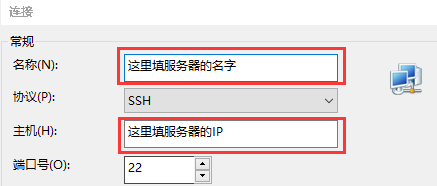
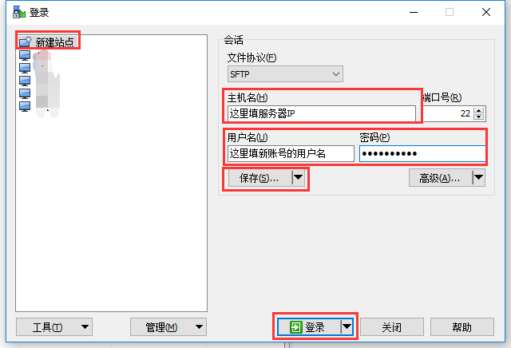

#### 连接服务器
为了使用服务器,你需要:
-  服务器的ip地址  
-  拥有**管理员权限**的服务器账号  

我们通过SSH的方式连入服务器,需要使用SSH 客户端,这里端推荐使用Xshell,目前的最新版是Xshell-6.  
Xshell-6是付费软件,但是提供免费教育版本,需要填写学校邮箱申请.(需要等待申请通过)  
为了方便,这里直接提供[Xshell-6教育版的网盘链接](https://pan.baidu.com/s/1nMEnduPI4nASoBDh0PlF_w).  

安装完成之后打开Xshell.  
在"会话"窗口中点击左上角的"新建",进入新建连接的界面.  
只需要修改下图中的2个红框部分,名称自行选择,"主机"填写服务器的ip地址.  

完成之后,点击确定,回到"会话"界面就会看到新建的连接.  
  
双击之后,进入填写用户的界面,填入有管理员权限账号的用户名->确定->填密码->确定.  
看到`name@xxx:~$` 就说明登录成功了.
>这里的name表示的是管理员账号的用户名

#### 创建自己的账号

>注意:这里的 **$USER-NAME** 指的是自己新账户的账户名

登陆成功之后,继续在刚才的界面输入  
`sudo adduser $USER-NAME` + 回车  
创建自己的账户
出现  
`[sudo] xxx 的密码：`  
之后,输入**管理员帐号**的密码,之后回车
>有两点需要注意:  
>1.输入的是**管理员账号**的密码,不是自己新账号的密码  
>2.输入密码之后不会出现 **\*\*\*\***  ,不要慌,问题不大,正常输入密码就行  

出现  
`输入新的 UNIX 密码：`  
之后,输入自己新帐号的密码,之后回车,再输入一次,然后一路连续回车,不用管,只到创建完成  

#### 使用自己的账号

>注意:  
1.这里的 **$USER-NAME** 指的是自己新账户的账户名  
2.`su`  是切换账户的命令

创建完成之后,输入  
`su $USER-NAME` + 回车  
再输入自己的密码,可以切换到自己的账号,来完成之后的操作  
切换账号会后记得再输入`cd ~` 把当前目录切换到自己的目录下  

#### 把用自己的账号添加到Xshell中
点击Xshell左上角的"文件"->"打开"->双击之前的服务器连接  
此时可以填写自己的账号信息,并且勾选下面的保存用户名/密码  
之后就可以双击之后直接登陆  

 `name@xxx:~$`  
 中的name就是当前登录的账号,通过这个可以知道目前登陆的是不是自己的账号

#### 上传文件至服务器
刚刚我们在服务器上创建了属于自己的账号,但是如何把本地的文件传输到服务器呢,这里推荐一个好用免费的远程文件管理软件Winscp([下载地址](https://winscp.net/eng/download.php))  
打开Winscp之后,先选择新建站点,然后按照图中红框从上到下的顺序依次操作:  
1."主机名":填入服务器的IP  
2."用户名和密码":填入刚刚新建账户的用户名和密码  
3.点击保存和登录  
  
Winscp的左侧是本地文件,右侧是服务器文件  
软件提供了可视化的上传下载操作,简单易上手,具体细节就不再多说了  
