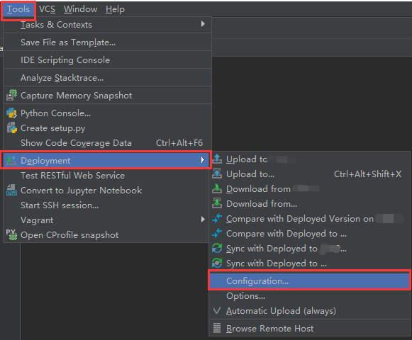
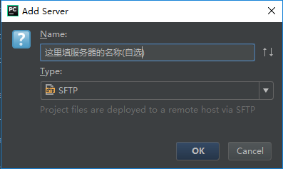
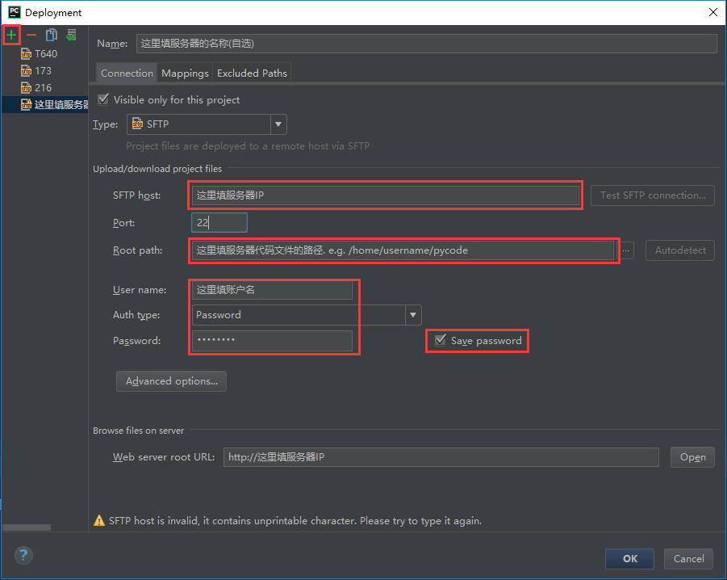
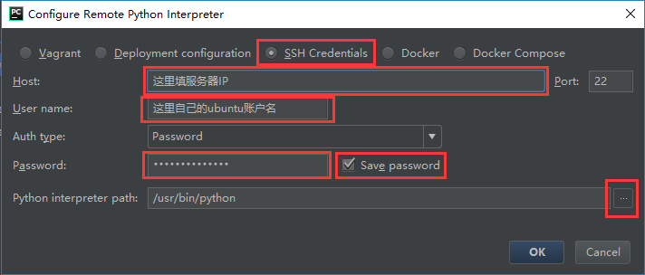

# 使用服务器跑程序

使用服务器资源跑程序，大概分为以下两种套路:  
1.使用SSH  
2.使用IDE远程调试  
下面来分别介绍

## 使用SSH

借助SSH客户端，使用服务器资源跑程序，大致分以下几个步骤:  
1.把需要运行的.py文件先用Winscp上传到服务器  
2.启动SSE客户端(Xshell)连接到服务器  
3.激活虚拟环境(source ~/.../activate)  
4.python xx.py

> ~~但是这样太麻烦了，我拒绝~~
推荐用下面介绍的高级舒适的方法

## 使用IDE远程调试

IDE(集成开发环境)可以提升我们的~~炼丹~~coding效率，有些IDE不仅有各种基础功能，还集成了代码同步和远程调试

> **代码同步** 可以把本机的代码传到服务器  
> **远程调试** 可以启动服务器端的Python解释器运行同步过去的代码

凭借这些功能我们就可以不离开本机的IDE只靠鼠标点点点使用服务器资源  
下面为大家推荐一个好用的Python IDE

### 合适的IDE: Pycharm YES!!

Python的IDE有很多，如若要选一个重量级的Python IDE，强烈推荐[Pycharm](http://www.jetbrains.com/pycharm/download)!!  

Pycharm一共有三种版本:

| 版本 | 基础功能 | 高级功能 | 教学套件 | Price |
| :--- | :---: | ---: | ---: | ---: |
| 社区版 | √ |  |  | 免费 |
| **专业版** | √ | √ |  | 付费/**学生免费** |
| 教育版 | √ | √ | √ | 付费/学生免费 |

其中教学套件我们不需要，为了使用后面会介绍的远程调试，代码同步等功能，请下载 [**专业版**](http://www.jetbrains.com/pycharm/download/) ，然后通过学校邮箱[申请专业版的免费License ](http://www.jetbrains.com/student/)

### 使用Pycharm

初次打开Pycharm,需要自行设置:  
1.创建python project，并且指定工程的存放目录  
2.顺便再选择一下本机的Python解释器  
整个过程比较简单，就不说了

### 配置远程代码同步

想要在服务器上运行.py文件，我们先得把.py文件传过去  
Pycharm内置了同步工程文件的功能，我们来配置一下:  
如下图所示，按照以下步骤操作:  
-&gt;点击Pycharm菜单栏的"Tools"  
-&gt;"Deployment"  
-&gt;"Configuration"  

  

之后会打开Deployment配置菜单  
首先点击配置菜单左上角的"**+**"，添加一个Server  
**Name** 填服务器的名称，自行选择  
**Type** 选择**SFTP**  

确定后，进入刚才创建的Server的详细配置界面  

  

按照红框从上到下顺序依次填入:  
1.服务器IP  
2.服务器代码文件夹路径

> 这个路径就是在服务器上你的代码放在哪的意思  
> 举个例子，用户名是username，我想把代码放在我自己用户根目录下面的pycode文件夹内  
> 那么，这里填入/home/username/pycode  
> 如果你一脸懵逼，不要慌，只要把上面的username换成自己的就好

3.ubuntu账户信息，并且勾上保存密码  
填完之后点击右侧的"Test SFTP connection"，通过之后表示配置成功，保存即可

上面的信息填完，保存完成后，Pycharm就可以与服务器之间进行文件同步了  
为了更加方便，我们打开Pycharm的**自动同步**功能，每当你修改了文件，Pycharm就会自动上传，保证服务器端的代码是最新状态  
具体按照以下步骤操作:  
-&gt;点击Pycharm菜单栏的"Tools"  
-&gt;"Deployment"  
-&gt;"Options"  
-&gt;"Upload changed files automatically to the default server"选项改为"Always"  

> P.S.  
 代码同步功能可以配置多个Server(见上图左侧栏)，但同时只能使用一个  
 具体使用哪个是通过Deployment界面左上角从左往右第四个按钮"**Use as Default**"进行调整的  
 当前正在使用的Server也会有加粗提示

### 配置远程python解释器

运行.py需要python解释器，Pycharm默认使用的是本地的解释器，这个可以自行设置  
上一步，我们已经完成了从本地到服务器的代码同步，现在我们来让Pycharm找到位于服务器上的解释器  
按照以下步骤操作:  
-&gt;点击Pycharm左上角的"File"  
-&gt;"Settings"  
-&gt;展开Settings左侧的Projec:XXX  
-&gt;Project Interpreter  
-&gt;点击右侧界面中最右侧的齿轮按钮  
-&gt;"Add Remote"  
之后会看到如下图的python远程解释器配置界面  

  

从上到下的红框是需要操作的部分:  
首先切换到"**SSH Credentials**"，然后依次填入**服务器IP**，ubuntu账号**用户名**和**密码**，并且勾上保存密码  
最后点击右下角的"..."选择解释器  
在路径浏览中切换到 **/home/你的用户名/你的python虚拟环境名称/bin/python** 后点击确认

> e.g. 假设我之前创建的账户是student，python虚拟环境的名字是py35env，并且存在用户根目录下，  
> 那么我的解释器路径就是 **/home/student/py35env/bin/python**

确认之后，Pycharm会收集远程解释器的相关信息  
完成之后，点击运行，Pycharm就会服务器上的Python运行存在服务器上的代码，并把结果返回

### 后续

#### 关于使用多台服务器的情况

如果你有多台服务器可供使用，请针对每台服务器依次完成上面介绍的配置过程:  
1.配置Python虚拟环境  
2.配置Pycharm解释器  
3.配置Pycharm代码同步  
为了方便，请尽量把不同服务器里的Python虚拟环境和代码目录**保持一致** 想在不同不服务器运行.py程序时，只需要:  
1.在"File"-&gt;"Settings"-&gt;"Project Interpreter"中切换Python远程解释器  
2.在"Tools"-&gt;"Deployment"-&gt;"Configuration"中的左侧栏选择服务器，然后点击**Use as Default** 3.主动选择Upload上传代码  
4.运行
