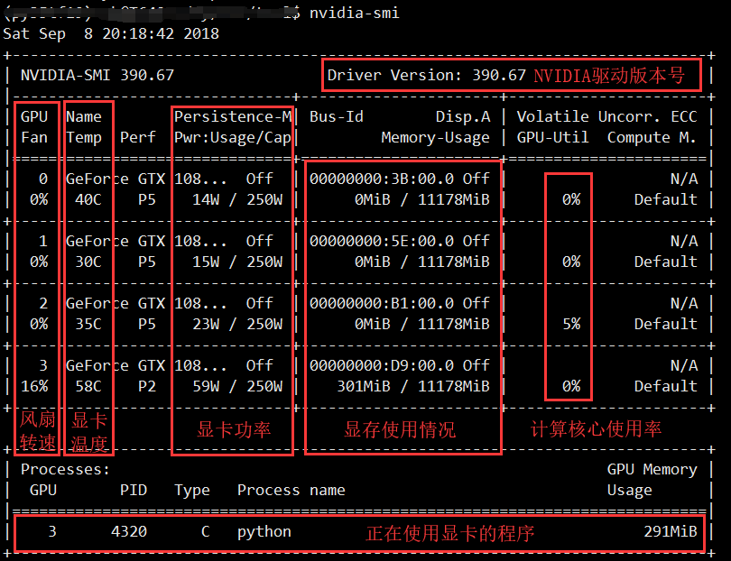
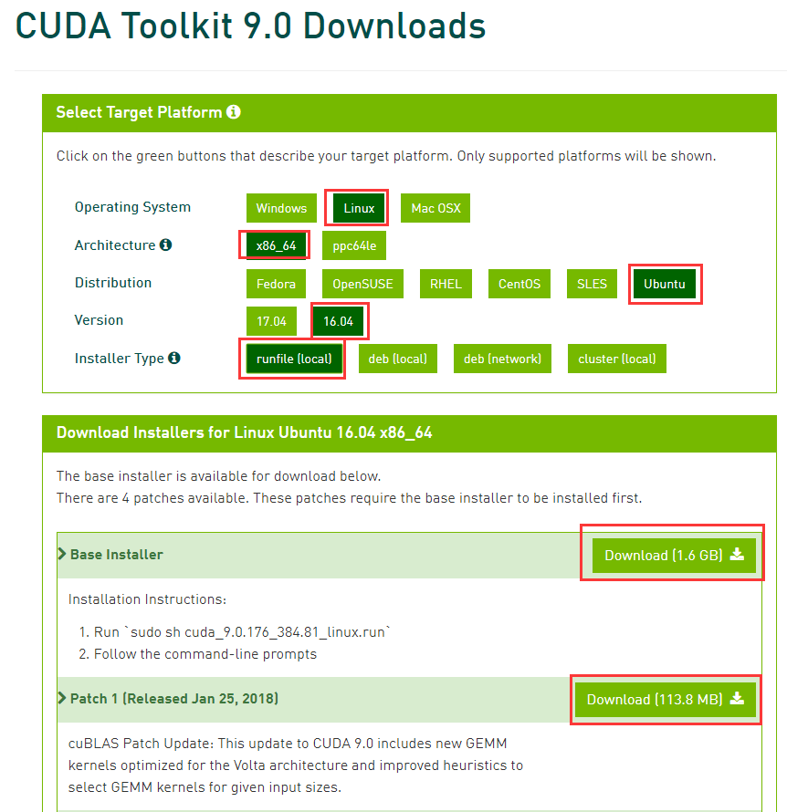
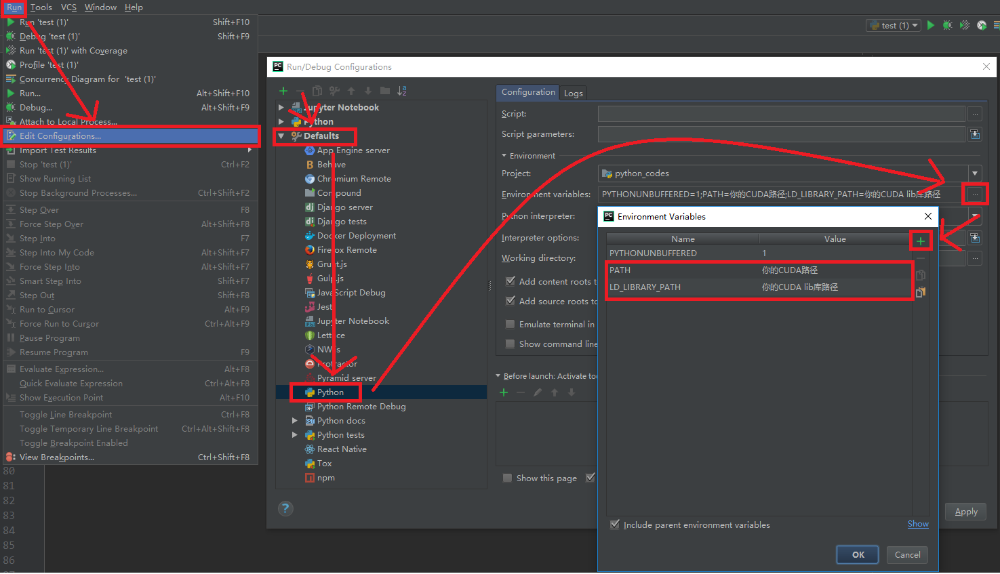

# cuda相关的安装

### 安装NVIDIA显卡驱动
**重要!** 在安装NVIDIA驱动前,请先确定服务器没有安装NVIDIA驱动,或者驱动不正常
使用命令
`nvidia-smi`
查看NVIDIA驱动和GPU状态

  

如果你看到了类似于这张图的输出,那么说明服务器**已经安装**了NVIDIA驱动,并且正常工作  
这种情况如果没有其他需求,请**不要重复安装驱动**  
如果提示找不到驱动或GPU设备,再请继续参考下面的安装教程

总共介绍NVIDIA显卡驱动的三种方法,推荐使用第一种：
- 方法1:
  登录服务器的桌面进行操作,出错的情况比较少,推荐
  首先确定服务器配置好[ubuntu清华源](https://mirrors.tuna.tsinghua.edu.cn/help/ubuntu/)或其他国内源后  
  进桌面->软件和更新->附加驱动->选择使用nvidia专用驱动->应用设置->等待安装完成

- 方法2:
    从[nvidia官网](https://www.nvidia.cn/Download/index.aspx?lang=cn)下载驱动，手动安装
    使用Xshell连入服务器,登录**有管理员权限的账户**,依次输入下面的命令
    ```
    # 暂时关闭显示服务
    sudo service lightdm stop  
    # 彻底清除之前安装的驱动程序
    sudo apt-get purge nvidia-*
    sudo nvidia-unstall
    # ./NVIDIA-Linux-*.run(官方驱动的.run文件) 这里填写之前下载的驱动文件路径(可以使用Winscp上传至服务器)
    sudo sh ./NVIDIA-Linux-*.run(官方驱动的.run文件) -no-x-check -no-nouveau-check -no-opengl-files  
    # 重新启动显示服务
    sudo service lightdm restart
    ```
- 方法3:
   使用cuda.run中自带的驱动
   具体方法后面会介绍到

### 安装CUDA
**重要!** 在安装CUDA驱动前,请先确定服务器目前已安装的CUDA版本,以免覆盖已安装的CUDA或者重复安装  
确认的方法:
1.最好先找学长学姐问一问
2.大部分人都会把CUDA安装到/usr/local目录下,你可以先用Winscp看看这个目录下有没有什么叫cuda的文件夹  
另外,使用命令
`nvcc -V`
可以查看当前正在使用的CUDA版本


本次教程以安装CUDA-9.0和cuDNN7.1为例,如果要安装其他版本,请注意适当改动(下载的文件,命令中的文件名等)

1. 下载CUDA
首先去[这里](https://developer.nvidia.com/cuda-toolkit-archive)找到要安装的CUDA版本,点进去进入下图所示的下载界面



我这边服务器是ubuntu16.04 x64,所以最上面4个红框如图选择,最后再选择下载runfile形式的文件,方便本地离线安装
下面1.6GB的文件是CUDA9.0的本体,还有后面的Patch也要全部下载下来  
>可能你选择的CUDA版本,没有Patch下载,那就不用下载了
另外下载前可能需要注册账号登录(我不太清楚了)


2. 安装CUDA
  把下载好的CUDA本体和Patch用Winscp上传到服务器,放到用户根目录下(~/)即可
  使用Xshell连入服务器,登录**有管理员权限的账户**
  输入下面的命令
  cuda_(version*)linux.run
  sudo sh **$CUDA_PATH**
  >  **$CUDA_PATH** 指的是CUDA安装文件的路径
  cuda安装文件名大概类似于cuda_(version*)linux.run,加入放在了/home/xx下面,那么命令就是
  sudo sh /home/xx/cuda_(version*)linux.run

  之后会让你输入一遍管理员的密码
  这时候回看到安装前的说明,我们就不看了,按住"空格键"会不断往下翻页,到达100%后松手,会看到:
  ```
  Do you accept the previously read EULA?  
  accept/decline/quit:
  ```
  问是否同意上面的条款,输入 **`accept`**

  ---
  ``
  Install NVIDIA Accelerated Graphics Driver for Linux-x86_64 384.81?
  (y)es/(n)o/(q)uit:
  ``
  问是否需要安装CUDA安装包内自带的驱动,这里的版本号是384,默认情况输入 **`n`**
  如果你确定服务器没装NVIDIA驱动,而且想通过这种方式安装,可以输入`y`  

  ---
  ```
  Install the CUDA 9.0 Toolkit?
  (y)es/(n)o/(q)uit:
  ```
  问是否要安装CUDA-9.0,不然呢,毫无理由拒绝,输入 **`y`**

  ---
  ```
  Enter Toolkit Location
  [ default is /usr/local/cuda-9.0 ]:
  ```
  问你想把CUDA装在哪里,重点来了,这里是第一个**新人操作,老人心碎**的地方
  在选择安装路径之前,请务必确认这个路径还**不存在**(可以用Winscp切换到服务器/usr/local目录下面看看),避免把之前别人安装的CUDA覆盖了
  另外,因为CUDA和cuDNN是绑定的,需要版本互相匹配,这里建议安装目录同时表示CUDA和cuDNN的版本,比如我这里准备装**CUDA-9.0**和与之配套的**cuDNN-7.1**,那我选的安装目录就是/usr/local/cuda9.0-cudnn7.1
  把这个`/usr/local/cuda9.0-cudnn7.1`或者你自己选的目录输入,进入下一步

  ---
  ```
  Do you want to install a symbolic link at /usr/local/cuda?
  (y)es/(n)o/(q)uit:
  ```
  问是否需要给才那个目录建一个快捷方式到/usr/local/cuda,建议选 **`n`**
  选y不仅容易把之前别人的快捷方式改掉,如果你自己依赖这个快捷方式,你又得担心别被后面的人改掉,还是算了

  ---
  ```
  Install the CUDA 9.0 Samples?
  (y)es/(n)o/(q)uit:
  ```
  问是否需要安装CUDA的测试样例,不需要,我们之后会用机器学习框架的程序测试,选 **`n`**

  ---
  之后等待安装完成即可
  注意看最后的说明,是安装完成,还是中途失败,如果只有一点警告,一般不是很影响
  >安装完成后,有时会提醒Incomplete installation,提示NVIDIA驱动版本太低,这时候你只需要用nvidia-smi确认下版本号,如果足够的话,不用理会,如果真的低于提示值,那就需要安装高一点的版本再来装CUDA

  注意,安装结束之后你应该会看到如下的提醒:
  >Please make sure that
    -   PATH includes /usr/lcoal/cuda9.0-cudnn7.1/bin
    -   LD_LIBRARY_PATH includes /usr/lcoal/cuda9.0-cudnn7.1/lib64

  这是CUDA告诉我们,虽然CUDA文件安装成功了,但是需要你自行设置两个系统变量 **\$PATH** 和 **\$LD_LIBRARY_PATH** ,我们先安装cuDNN,稍后设置这个

3.安装cuDNN
  严格来说不算是"安装",我们只需要吧cuDNN复制到CUDA目录下就好  
  那么首先[点这里](https://developer.nvidia.com/rdp/cudnn-archive)下载对应版本的cudnn  
  没记错应该是需要注册个账号,填一个问卷才能下载  
  需要注意的是cuDNN的版本也需要跟你安装的CUDA匹配,我们之前说要安装CUDA9.0和cuDNN7.1,所以我选择  
  ```
  Download cuDNN v7.1.3 (April 17, 2018), for CUDA 9.0
  -> cuDNN v7.1.3 Library for Linux
  ```
  下载完成后,解压,用Winscp传到服务器某个目录下,
  加入你传到了/home/xx/cudnn7.1这个目录下,没出错的话,这个目录下应该有**include**和**lib64**两个文件夹
  我们把这两个文件夹里的东西复制到CUDA的同名目录下
  使用下面的命令进行复制:
  `sudo cp -r /home/xx/cudnn7.1/* /usr/local/cuda9.0-cudnn7.1/`
  >sudo 是因为我们复制文件的目标目录需要管理员权限
   cp是文件复制命令,加参数-r表示递归复制(把整个文件夹下的文件都复制过去)
   /home/xx/cudnn7.1/表示cudnn解压后的文件所在目录
   和/usr/local/cuda9.0-cudnn7.1/表示CUDA文件所在目录
   请根据自己的情况酌情修改

4. 设置系统变量(根据情况选择)
   恭喜,完成上面的123步骤,你已经成功吧CUDA和cuDNN安装到了服务器上,但是使用.run文件安装CUDA和cuDNN之后,机器学习框架(tensorflow/pytorch等)不能知道它们的所在位置,需要你设置以下两个系统变量:

   软件读取系统变量的方式,稍微有些复杂,简单来说,系统变量由两个文件控制
   - 第一个文件在`/etc/profile`,它的影响范围是所有用户,所以一般不建议修改这个文件,除非你是第一个使用服务器的人,你想让后面的人默认有CUDA可以用,才建议修改这个文件

   - 第二个文件在`~/.bashrc`,它的影响范围是单个用户,一般建议修改这个文件  
   `~`的意思是用户根目录,举个例子,如果你的用户名是`username`,那么`~`代表的就是'/home/username',根据这个路径我们可以知道这个每个用户都有一个属于自己的`.bashrc`

   请你根据自己的情况选择修改哪个文件,如果要修改`/etc/profile`,请使用管理员帐号操作,并且要在修改的命令前加`sudo`

   添加系统变量的方法:
   首先输入下面的命令,打开文件编辑界面:
   `nano .bashrc`
   或
   `sudo nano /etc/profile`
   然后把下面的内容复制到文件的最后,然后Ctrl+X->y>回车,完成保存:
   ```
   export PATH=YOUR_CUDA_PATH/bin:$PATH
   export LD_LIBRARY_PATH=YOUR_CUDA_PATH/lib64:$LD_LIBRARY_PATH
   ```
   请把上面的**YOUR_CUDA_PATH**替换成你安装CUDA的路径,比如说CUDA装到了/usr/local/cuda9.0-cudnn7.1,那就把**YOUR_CUDA_PATH**换成**/usr/local/cuda9.0-cudnn7.1**  
   >解释:
    **PATH** 是ubuntu中搜索执行程序/软件的目录列表,通过它告诉其他软件CUDA的路径
    **LD_LIBRARY_PATH** 是ubuntu中搜索lib库的目录列表,通过它告诉其他软件CUDA的lib库路径

    以上修改完成之后,关闭掉现在的Xshell窗口,重新开一个Xshell,修改就会生效
    >提示:
    输入命令env可以查看目前生效的所有的系统变量
    输入命令echo 变量名 可以查看指定的系统变量的值
    .bashrc是隐藏文件,Winscp中可能看不到,在Xshell中输入ls -a,可以看到隐藏文件

### Pycharm设置  
Pycharm的PATH按照如下图的方式设置:  
-->点击Pycharm上方菜单栏中的"Run"  
-->"Edit Configurations.."  
-->在弹出的"Run/Debug Configurations"框中的左侧栏点击Defaults,并选择下面的Python  
-->点击框右侧"Environment Variables"右边的'**...**',打开系统变量设置框  
-->点击设置框右上角的'**+**'依次添加环境变量PATH和LD_LIBRARY_PATH,左侧填变量名,右侧填路径(与.bashrc或/etc/profile的路径一样)  


  
